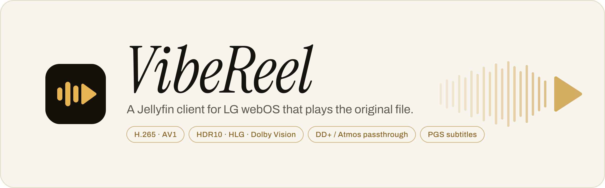
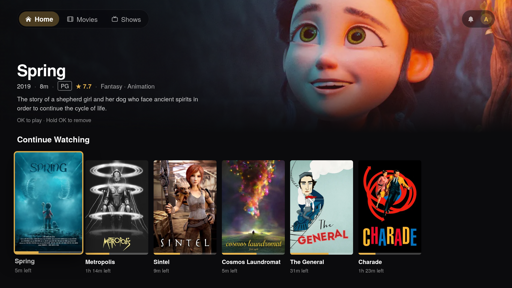
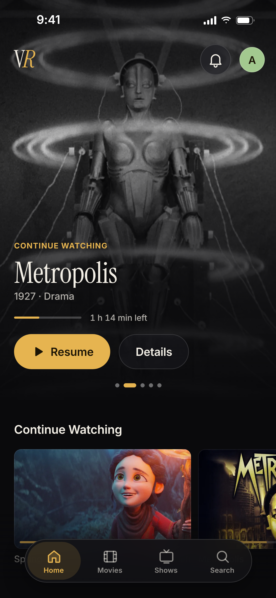
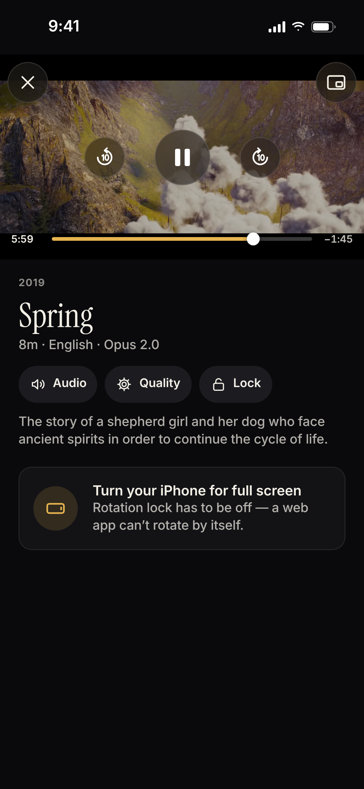
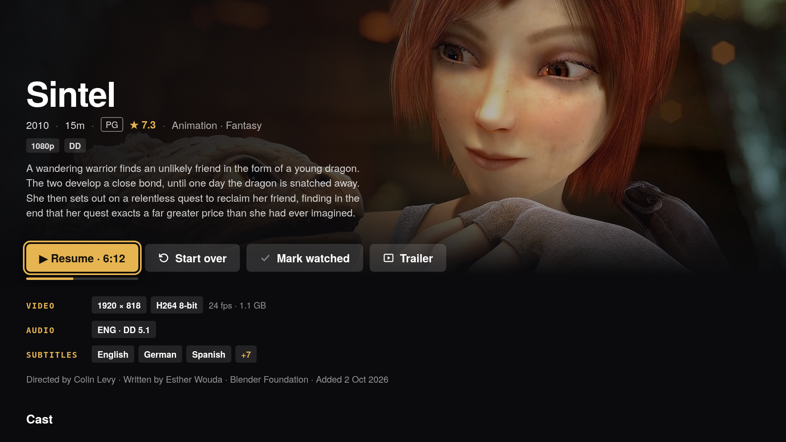
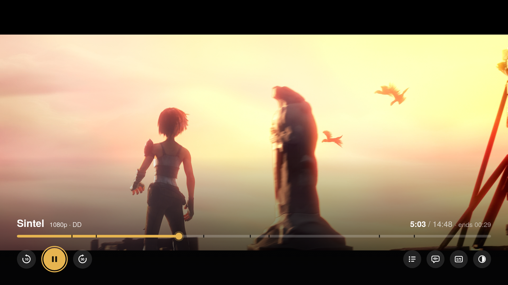
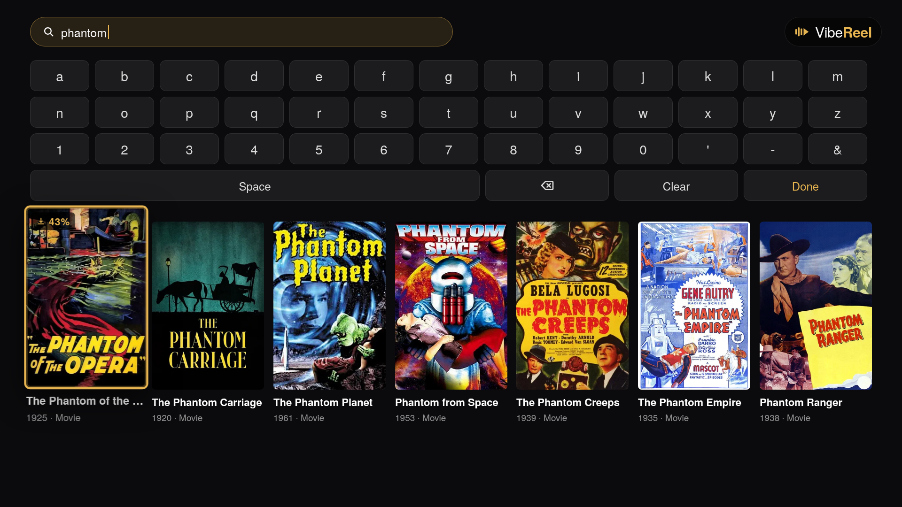
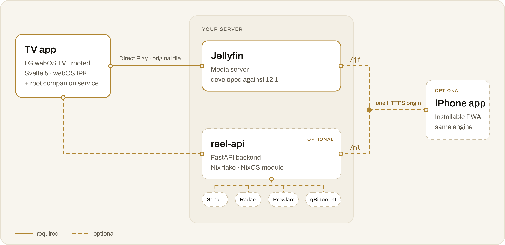

<p align="center">
  <picture>
    <source media="(prefers-color-scheme: dark)" srcset="docs/readme/hero-dark.svg">
    <source media="(prefers-color-scheme: light)" srcset="docs/readme/hero-light.svg">
    
  </picture>
</p>

<p align="center">
  A Jellyfin client for a <b>rooted</b> LG webOS TV that plays the original file, with no transcoding,<br>
  through the TV's own media pipeline. Plus an optional iPhone app and an optional *arr backend.
</p>

<p align="center">
  <a href="LICENSE"></a>
  
  
  
</p>

<p align="center">
  
  
  
</p>

<details>
<summary><b>More screenshots</b>: detail page, player, search</summary>
<br>
<p align="center">
  
  
</p>
<p align="center">
  
</p>
</details>

<p align="center"><sub>Screenshots use a demo library of public-domain films and TV episodes and Blender Foundation open movies (CC BY).</sub></p>

> [!NOTE]
> A personal project, built for and tested on one setup: an LG C4 (webOS 10.3.1), a Jellyfin 12.1 server on a NixOS NAS, and an iPhone. It will probably need adjusting for anything else. Not affiliated with Jellyfin or LG.

## What's inside

| | Part | | What it is |
|:-:|---|---|---|
|  | **TV app**<br>`src/` `public/` | core | Svelte 5 + Vite, packaged as a webOS IPK (`com.kirill.reel`). Works with Jellyfin alone. Ships with a **companion service** (`service/`): a tiny root Node service on the TV that switches picture modes. |
|  | **iPhone app**<br>`phone/` | optional | Svelte 5 PWA that reuses the TV's `src/lib` under a touch UI: offline downloads, AirPlay, push notifications. |
|  | **reel-api**<br>`backend/` | optional | FastAPI service on the NAS in front of Sonarr, Radarr and qBittorrent: search and add, download progress inside the library, watch while downloading, trending and IMDb charts, trailers, new-season alerts. |

## Why: no transcoding

The device profile has no transcoding profiles. The original file goes to the TV's own pipeline through `<video>` Direct Play, so HDR passes straight through and DD+, AC3 and DTS reach your soundbar untouched.

| | How |
|---|---|
| **Video** | H.265 / H.264 / AV1 via Direct Play |
| **HDR** | HDR10 / HLG / Dolby Vision, passed straight through from the stream |
| **Audio** | DD+/E-AC3 · Atmos, AC3 and DTS passthrough; AAC/Opus → PCM. DD+ is preferred over a container-default TrueHD; anime defaults to the Japanese track |
| **Subtitles** | SRT / ASS as VTT; PGS decoded client-side by libpgs onto a canvas. VobSub / DVB are the one exception: burned in via a one-off HLS transcode |
| **Skip Intro / Recap** | Jellyfin Media Segments (Intro Skipper plugin), named chapters, and the crowdsourced IntroDB |
| **Up Next** | at the credits, a card with a 10 s countdown rolls on to the next episode |
| **Trickplay** | scrubbing previews from Jellyfin's thumbnail sheets; the real seek happens once you stop |
| **Picture mode** | Filmmaker / Cinema / … per signal (SDR, HDR10, Dolby Vision), switched from the OSD via the companion service |
| **Also** | audio/subtitle picks carry over to later episodes (matched by language); resume and watched state sync to Jellyfin |

> [!NOTE]
> **The TrueHD reality.** No TV app can pass lossless TrueHD through: webOS only relays a lossless bitstream that arrives on an HDMI input, and audio from inside the TV leaves as PCM or Dolby Digital/DD+. So when a file has both TrueHD and a DD+ Atmos track (most do), VibeReel plays the DD+ track: lossy Atmos, but the best the platform allows. See `describeTracks()` in `src/lib/tracks.js`.

<details>
<summary><b>Browsing on the TV</b></summary>

- **Home:** hero, Continue Watching, Next Up, and Trending shows and movies (popular on IMDb right now, rated ★ 7.5+), which can be added straight from the rail.
- **Movies / Shows:** paged grids, sortable and filterable by genre and unwatched. Detail pages have cast, tech badges, similar titles, a franchise collection rail, and a Trailer button that plays the YouTube trailer in the app's own player (the backend fetches it).
- **Search** (<kbd>▲</kbd> from the tab bar): Sonarr/Radarr lookup with its own on-screen keyboard, plus IMDb Top 250 and per-genre charts. A title already in Jellyfin opens there; one that isn't can be added.
- **Downloads are merged in**, not kept in a separate tab. Queued titles appear in the grids and as dimmed episode rows with live progress, and a downloading file can be watched while it downloads (sequential download, streamed from the growing file).
- **A bell** lists new seasons of shows you have (with a Get button) and titles that just became ready to watch. The avatar switches between accounts.

</details>

<details>
<summary><b>The iPhone app</b></summary>

The same library, playback engine and download features under a native-feeling touch UI: tab stacks, sheets, gestures, a custom player with AirPlay (and PiP in a Safari tab), offline downloads, push notifications ("Ready to watch", new seasons), and Home painted from the last session at launch.

Safari can't play MKV, TrueHD or DTS, so on the phone Jellyfin remuxes to HLS fMP4 with the video copied. Only the audio is converted where it has to be. Details are in [`docs/ios/`](docs/ios/), starting with [`ARCHITECTURE.md`](docs/ios/ARCHITECTURE.md) and [`MEDIA-TEST.md`](docs/ios/MEDIA-TEST.md).

</details>

## Will it work for me?

- [ ] **A rooted LG webOS TV** with ssh as root (RootMyTV / Homebrew Channel). `deploy.sh` unpacks the app straight into the TV's app directory instead of relying on a Developer Mode session, and the companion service starts from a Homebrew Channel boot hook.
- [ ] **TV audio output set to Pass Through / Bitstream (eARC)**, so DD+/AC3/DTS reach the soundbar instead of being downmixed.
- [ ] **A Jellyfin server** (developed against 12.1). The TV app works with Jellyfin alone.
- [ ] *Optional:* **the backend** with Sonarr, Radarr, Prowlarr and qBittorrent, for search/add, download activity, watch-while-downloading, trending, charts, trailers and news. See [`backend/README.md`](backend/README.md).
- [ ] *For the iPhone app:* **an HTTPS origin** that serves the PWA with Jellyfin under `/jf` and the backend under `/ml` (one origin: no CORS, one service-worker scope). The author uses `tailscale serve` in front of nginx.
- [ ] **Tooling:** Node 22 and ImageMagick, or `nix develop` (also brings `sshpass` and `jq`).

## Quick start

**1. Configure.** Fill in your Jellyfin and backend URLs, the TV's address and, optionally, its MAC for Wake-on-LAN.

```sh
cp .env.example .env.local     # gitignored
```

Vite builds the `VITE_*` values into the TV app as defaults; the deploy scripts read the rest. Without `VITE_JELLYFIN_URL` the TV's login screen asks for the server.

**2. Build and install on the TV.**

```sh
nix develop                   # or: have node 22 + imagemagick on PATH
npm install
./deploy.sh                   # icons + build + IPK, install on the TV, relaunch, md5-verify
./deploy-service.sh           # install/restart the picture-mode companion service
```

**3. Sign in** with Quick Connect (approve the code in Jellyfin), or press <kbd>▼</kbd> for username and password.

<details>
<summary>What <code>deploy.sh</code> does</summary>

It wakes the TV over Wake-on-LAN if it's off, stages the new build next to the installed one and swaps it in only once complete, then relaunches the app and checks that the new build is actually running. The first install of a brand-new app goes through webOS's `dev/install` once. `./build-ipk.sh` alone just produces `out/*.ipk`.

</details>

<details>
<summary><b>Backend</b> (optional)</summary>

See [`backend/README.md`](backend/README.md): a Python package with a Nix flake and a NixOS module, configured through environment variables (Sonarr/Radarr/qBittorrent URLs and keys, VAPID keys for push).

</details>

<details>
<summary><b>iPhone app</b> (optional)</summary>

```sh
npx vite build --config phone/vite.config.js    # → phone/dist
./phone/deploy.sh                               # rsync to the server (NAS=, ORIGIN= in .env.local), atomic swap, md5-verify
```

The server has to serve `phone/dist` at `/`, Jellyfin at `/jf` and the backend at `/ml` (passing the browser's `Host` through, or naming it in the backend's allowed hosts), with `index.html` and `sw.js` sent as no-cache. `phone/deploy.sh` expects releases under `/var/lib/vibereel-phone/` with a `current` symlink. Open the origin in Safari and Add to Home Screen; push notifications only reach the home-screen app.

</details>

## How it fits together

<p align="center">
  <picture>
    <source media="(prefers-color-scheme: dark)" srcset="docs/readme/architecture-dark.svg">
    <source media="(prefers-color-scheme: light)" srcset="docs/readme/architecture-light.svg">
    
  </picture>
</p>

## Things you should know

> [!WARNING]
> VibeReel needs a **rooted TV**, runs a **root service outside the webOS jail**, and its backend's only login is your Jellyfin one. It also leans on yt-dlp and undocumented IMDb and Radarr endpoints. Read every point below before you install it.

- **What gets downloaded is up to you.** The backend automates your own Sonarr, Radarr and qBittorrent, and knows no indexer itself: it never searches or adds a torrent on its own, and what Sonarr and Radarr fetch depends entirely on the indexers you give them (e.g. through Prowlarr). Only use it for content you have the right to download. The NixOS module also runs FlareSolverr, which gets Prowlarr through Cloudflare challenges on indexers that use them.
- **The backend trusts every Jellyfin user to add titles.** Each request must carry the access token of a user signed in to your Jellyfin (the apps send theirs; the backend asks Jellyfin who it belongs to), and the Host and browser Origin must name your server, which stops DNS-rebinding and cross-site requests from web pages opened on your LAN. Jellyfin administrators may do everything. Any other user can add titles (up to 10 movies and 10 series at a time, configurable), and can cancel, undo or delete — files included — only the titles they added. Anyone signed in can stream the files being downloaded, so keep it on your LAN (or a tailnet). It stores each push subscriber's Jellyfin access token and who added which title in its state directory.
- **Trailers are downloaded from YouTube with yt-dlp.** That is against YouTube's terms of service and breaks whenever YouTube changes something, until yt-dlp catches up. When it fails, the TV opens the trailer in the YouTube app instead.
- **Trending and the IMDb charts use IMDb's internal GraphQL endpoint**, called with the header of IMDb's own web client. It is undocumented and unsupported and can stop working at any time. The franchise rail likewise reads Radarr's metadata service (`api.radarr.video`) directly, which is Radarr's backend rather than a public API.
- **The TV app needs a rooted TV.** Root comes with a root ssh server (webosbrew's default password is `alpine`: install a key or change it), and since a firmware update can remove root, rooted TVs usually have updates blocked, security fixes included.
- **The companion service runs as root** outside the webOS jail and registers on the luna bus as `com.webos.app.multiviewsettings-reel`, so the bus grants it the settings permission of LG's own Multi-View Settings app. That deliberately bypasses webOS's permission model, and a bug in the service is a root bug. It listens only on `127.0.0.1:8791`, with `Access-Control-Allow-Origin: *`, so any app or web page on the TV can read and switch the picture mode through it; that is all it exposes.

## Development

<details>
<summary>Dev servers, build checks, conventions, repository layout</summary>

### Dev servers

```sh
npx vite dev                                    # TV app on http://127.0.0.1:8899 (HMR)
npx vite --config phone/vite.config.js          # phone app on http://127.0.0.1:8900
```

The TV app runs in a desktop browser against the real server, because Jellyfin sends `Access-Control-Allow-Origin: *`. Arrow keys work as the D-pad, <kbd>Enter</kbd> is OK and <kbd>Esc</kbd> is Back. Video decode, HDR, audio passthrough, PGS and picture modes only work on the TV. The app is inspectable, so attach Chrome DevTools to `http://<tv>:9998` to debug there.

The phone dev server proxies `/jf` and `/ml` to the URLs in `.env.local`. [`phone/DEV-CHROME.md`](phone/DEV-CHROME.md) describes an iPhone frame for desktop Chrome (safe areas, touch emulation, rotation).

### Build checks

Four suites, all offline (no real Jellyfin, TV or NAS):

```sh
npx vitest run                                   # shared client logic, TV + phone projects
node types/check-ratchet.mjs                     # JSDoc types via svelte-check, strict, 0 errors
(cd backend && uv run --frozen --group dev python tests/fetch_fixtures.py)   # once
(cd backend && uv run --frozen --group dev pytest)                           # the backend
node e2e/scripts/fetch-spec.mjs && node e2e/run.mjs   # both apps in headless Chrome against a fake server
```

`npx vite build` and `npx vite build --config phone/vite.config.js` must both pass, and the TV bundle must not contain phone code:

```sh
grep -c -e 'VibeReel Phone' -e main.m3u8 -e ManagedMediaSource dist/app.js   # → 0
```

Before bumping Jellyfin on the server, `integration/jellyfin/run.sh` runs both apps and the
shared client code against a throwaway copy of the new version (from nixpkgs, on loopback)
and diffs its API against what the apps use — see
[`integration/jellyfin/README.md`](integration/jellyfin/README.md).

### Conventions

- Svelte 5 runes. The TV runs Chromium 120, and Vite targets `chrome120`.
- `src/style.css` is one global stylesheet for a fixed 1920×1080 layout.
- D-pad focus is geometric and reads the live DOM: every focusable element needs `class="focus"` and a unique `data-focus` key.
- Icons are inline SVG (`src/lib/icons.js`). The webOS fonts render several common symbols as tofu.
- Code shared with the phone (`src/lib`) branches on `__PHONE__`, which is constant-folded, so the TV bundle stays free of phone code.

### Repository layout

```
src/            TV app: lib/ (logic: player engine, device profile, D-pad focus, api),
                screens/, components/, style.css
public/         shipped verbatim: appinfo.json, a 60p clip that resets the TV's refresh rate
service/        TV companion service (luna bus → picture settings, HTTP on 127.0.0.1:8791)
phone/          iPhone PWA: src/ (UI), dev/ (dev-server tooling), public/ (icons, sw.js)
backend/        reel-api (FastAPI) + Nix flake and NixOS module
docs/ios/       iPhone architecture, media tests, UX audit, design spec and polish notes
build-ipk.sh, deploy.sh, deploy-service.sh, tv-ssh.sh, env.sh    packaging and install
```

</details>

## Documentation

- [`backend/README.md`](backend/README.md): the reel-api backend, its Nix flake, NixOS module and environment variables
- [`docs/ios/`](docs/ios/): iPhone architecture, media tests, UX audit, design spec and polish notes

## License

MIT © Kirill Menke. Third-party components shipped in this repository (libpgs, MIT, with parts of core-js; Instrument Serif, SIL Open Font License; a snippet from the webOS Homebrew Channel, MIT) and their licenses are listed in [`THIRD_PARTY_NOTICES.md`](THIRD_PARTY_NOTICES.md).
